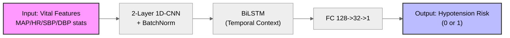
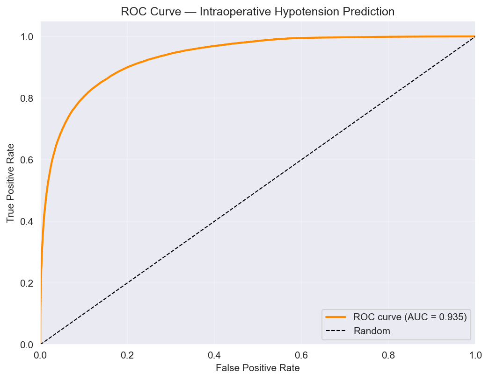
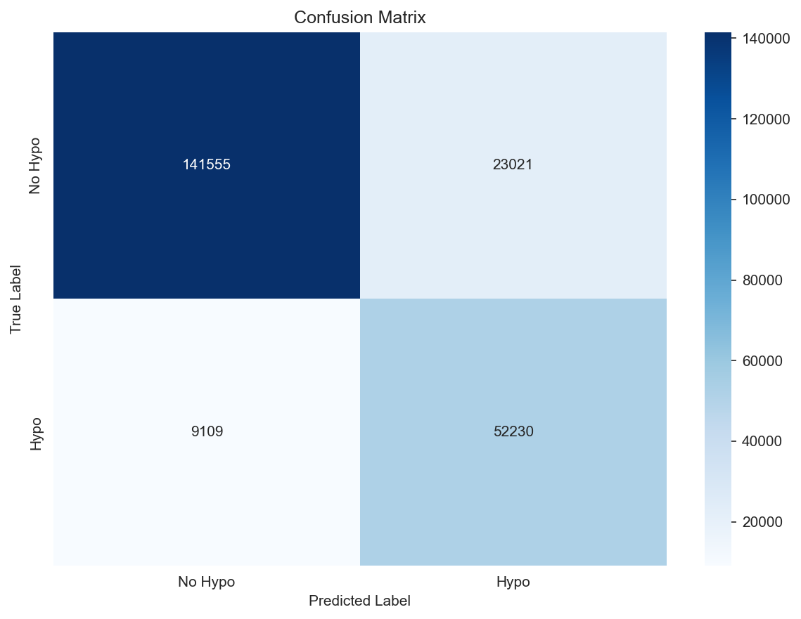

# Intraoperative Hypotension Prediction using VitalDB

## Abstract

This project implements a deep learning pipeline for **early prediction of intraoperative hypotension** from high-fidelity vital signs. We use arterial blood pressure (ART) and derived vital features from the [VitalDB Open Dataset (v1.0.0)](https://khdp.net/database/data-search-detail/658/vitaldb_open/1.0.0) (K-Health Data Platform) to predict the occurrence of hypotension (MAP &lt; 75 mmHg sustained for ≥10 s) **5 minutes ahead**. The final model (**HypotensionModelV2**) combines a **2-layer 1D-CNN** (with BatchNorm) for local feature extraction and a **bidirectional LSTM** for temporal dependency modeling, achieving **test AUC-ROC 0.935** on the full dataset. The pipeline is designed for reproducibility and scalability on a single-GPU workstation with in-memory data loading.

**Keywords:** intraoperative hypotension, VitalDB, 1D-CNN, BiLSTM, hemodynamic prediction, medical AI.

---

## Environment (Hardware)

| Component | Specification |
|-----------|---------------|
| **CPU**   | Intel Core i9-14900K |
| **GPU**   | NVIDIA GeForce RTX 4070 (12 GB VRAM) |
| **RAM**   | 128 GB (in-memory data loading for full dataset) |

Training is performed on GPU with CUDA; the full dataset is loaded into host memory and transferred to device to maximize throughput.

---

## Dataset

- **Source:** [VitalDB Open Dataset (v1.0.0)](https://khdp.net/database/data-search-detail/658/vitaldb_open/1.0.0) on the **K-Health Data Platform** — an open, high-fidelity multi-parameter vital signs database from surgical patients (Seoul National University Hospital).
- **Scale:** Approximately **6,000 cases** (vital recordings with clinical metadata).
- **Signals:** Arterial blood pressure (ART) and related waveforms; derived MAP, SBP, DBP, HR as needed for labeling and feature extraction.
- **Task:** Binary classification — whether hypotension (MAP &lt; 75 mmHg for ≥10 s) will occur within the next 5 minutes, using a configurable lookback window.

---

## Model Architecture

The final model (**HypotensionModelV2**) uses a 2-layer 1D-CNN, bidirectional LSTM, and a 2-layer fully connected head:



- **Input:** Summary statistics (mean, std, min, max, trend) over a 5-min lookback for MAP, HR, SBP, DBP.
- **1D-CNN:** Two Conv1d blocks (32→64 channels) with BatchNorm and dropout for local pattern extraction.
- **BiLSTM:** Bidirectional LSTM for forward and backward temporal dependencies.
- **Output:** Binary risk (0 or 1) for hypotension within the next 5 minutes.

---

## Results

| Metric       | Value   |
|-------------|---------|
| **AUC-ROC** | **0.935** |
| Accuracy    | 0.86    |
| Task        | Binary classification (hypotension within 5 min) |
| Data        | Full VitalDB Open Dataset (v1.0.0); case-level train/val/test split |
| Model       | HypotensionModelV2 (2-layer CNN + BiLSTM + FC head) |

The model was trained on the **full VitalDB Open Dataset (v1.0.0)** and achieves **AUC-ROC 0.935** on the test set, with validation AUC 0.935 used for model selection.

### ROC Curve (Test Set)



### Confusion Matrix (Test Set)



---

## Key Features

- **Local file–based loading:** Direct reading of VitalDB `.vital` files and `clinical_data.csv` from local storage (no cloud API dependency).
- **Large-scale preprocessing pipeline:** End-to-end pipeline for thousands of cases: waveform/metadata loading, label generation (hypotension onset), optional feature extraction or windowing for 1D-CNN+LSTM input, train/validation/test splits (e.g., case-level), and optional in-memory caching for 128 GB RAM setups.
- **Reproducibility:** Configuration-driven design (e.g., thresholds, lookback, horizon, random seeds) and standard dependency management (`requirements.txt`).

---

## Repository Structure

```
VitalDB-Hypotension-Prediction/
├── main.py # 메인 실행 파일 (전체 파이프라인 진입점) 
├── train.py # 모델 학습 및 검증 루프 (Training Loop) 
├── model.py # 딥러닝 모델 아키텍처 (1D-CNN + BiLSTM) 
├── data_loader.py # VitalDB 데이터 로딩 및 전처리 클래스 
├── build_dataset.py # Raw 데이터셋 구축 및 캐싱 스크립트 
├── config.py # 하이퍼파라미터 및 경로 설정 (Configuration) 
├── utils.py # 유틸리티 함수 (시드 고정, 디바이스 설정 등) 
├── docs/ # 프로젝트 문서 및 결과 이미지 (figures 포함) 
├── notebooks/ # 데이터 분석 및 실험용 Jupyter Notebook 
├── scripts/ # 보조 실행 스크립트 모음 
├── checkpoints/ # 학습된 모델 가중치 저장 폴더 
├── requirements.txt # 파이썬 의존성 패키지 목록 
└── README.md # 프로젝트 설명서

```

---

## Installation

```bash
# Clone the repository
git clone https://github.com/heuiseung/VitalDB-Hypotension-Prediction.git
cd VitalDB-Hypotension-Prediction

# Create and activate a virtual environment (recommended)
python -m venv .venv
# Windows (PowerShell):
.\.venv\Scripts\Activate.ps1
# Linux/macOS:
# source .venv/bin/activate

# Install dependencies
pip install -r requirements.txt
```

---

## Usage

After installing dependencies and placing the VitalDB data (e.g., `vital_files/` and `clinical_data.csv`) in the path set in `config.py`:

```bash
python main.py
```

This runs the full pipeline: build dataset (if `hypotension_dataset.csv` is missing), then train **HypotensionModelV2** and save the best model by validation AUC. To export all result figures (ROC curve, confusion matrix, feature/label distributions):

```bash
python scripts/export_all_figures.py
```

---

## Configuration

Key parameters (e.g., hypotension threshold, lookback and prediction horizon, batch size, device) are set in `config.py`. Adjust paths and hyperparameters there for your environment.

---

## Author
**HEUISENG JEONG**

## License & Citation
This project is licensed under the **MIT License** - see the [LICENSE](LICENSE) file for details.

### Data Attribution & Disclaimer
This project utilizes the **VitalDB Open Dataset (v1.0.0)** accessed through the [K-Health Data Platform (KHDP)](https://khdp.net/database/data-search-detail/658/vitaldb_open/1.0.0).
* **Original Source:** Seoul National University Hospital (SNUH) VitalDB.
* **Data Access:** The data itself is **NOT** included in this repository. Users must request access and download the data directly from the KHDP or VitalDB website in compliance with their terms of use.